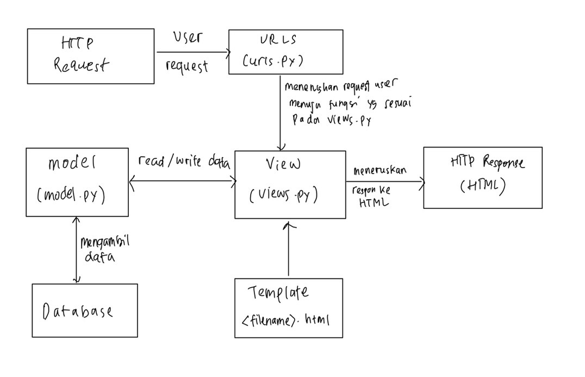

**Buatlah bagan yang berisi request client ke web aplikasi berbasis Django beserta responnya dan jelaskan pada bagan tersebut kaitan antara `urls.py`, `views.py`, `models.py`, dan berkas `html`;**

#bagan tabel


**Jelaskan kenapa menggunakan virtual environment? Apakah kita tetap dapat membuat aplikasi web berbasis Django tanpa menggunakan virtual environment?**
> Menggunakan *virtual environment* agar mengisolasi *package* serta *dependencies* dari aplikasi sehingga tidak bertabrakan dengan versi lain yang ada di komputer. Kita tetap bisa menggunakan django tanpa *virtual environment*, tetapi disarankan memakai *virtual environment* supaya kita bisa menjalankan aplikasi web dengan versi django berbeda-beda pada satu komputer

**Jelaskan bagaimana cara kamu mengimplementasikan poin 1 sampai dengan 4 di atas**

1. 
Buka `views.py` yang ada pada folder `katalog` lalu buat fungsi yang menerima parameter `request` dan mengembalikan `render(request, "katalog.html")`.
```
def show_katalog(request):
return render(request, "katalog.html")
```

2. 
Pada `urls.py` kita menambahkan kode untuk melakukan routing 
```
from django.urls import path
from katalog.views import show_katalog

app_name = 'katalog'

urlpatterns = [
    path('', show_katalog, name='show_katalog'),
]
```

3.
Ubah `Fill me!` yang ada di dalam HTML tag `<p>` menjadi `{{nama}}` untuk menampilkan nama di halaman HTML
```
  <h5>Name: </h5>
  <p>{{nama}}</p>

  <h5>Student ID: </h5>
  <p>{{student_ID}}</p>
```

Untuk memetakan data barang, perlu melakukan iterasi variabel `list_barang` dan menambahkan kode pada file HTML
```
 Tambahkan data di bawah baris ini 

    <tr>
        <th>{{barang.item_name}}</th>
        <th>{{barang.item_price}}</th>
        <th>{{barang.item_stock}}</th>
        <th>{{barang.description}}</th>
        <th>{{barang.rating}}</th>
        <th>{{barang.item_url}}</th>
    </tr>

```

=======


**Jelaskan kenapa menggunakan virtual environment? Apakah kita tetap dapat membuat aplikasi web berbasis Django tanpa menggunakan virtual environment?**
> Menggunakan *virtual environment* agar mengisolasi *package* serta *dependencies* dari aplikasi sehingga tidak bertabrakan dengan versi lain yang ada di komputer. Kita tetap bisa menggunakan django tanpa *virtual environment*, tetapi disarankan memakai *virtual environment* supaya kita bisa menjalankan aplikasi web dengan versi django berbeda-beda pada satu komputer

**Jelaskan bagaimana cara kamu mengimplementasikan poin 1 sampai dengan 4 di atas**

1. 
Buka `views.py` yang ada pada folder `katalog` lalu buat fungsi yang menerima parameter `request` dan mengembalikan `render(request, "katalog.html")`.
```
def show_katalog(request):
return render(request, "katalog.html")
```

2. 
Pada `urls.py` kita menambahkan kode untuk melakukan routing 
```
from django.urls import path
from katalog.views import show_katalog

app_name = 'katalog'

urlpatterns = [
    path('', show_katalog, name='show_katalog'),
]
```

3.
Ubah `Fill me!` yang ada di dalam HTML tag `<p>` menjadi `{{nama}}` untuk menampilkan nama di halaman HTML
```
  <h5>Name: </h5>
  <p>{{nama}}</p>

  <h5>Student ID: </h5>
  <p>{{student_ID}}</p>
```

Untuk memetakan data barang, perlu melakukan iterasi variabel `list_barang` dan menambahkan kode pada file HTML
```
 Tambahkan data di bawah baris ini 

    <tr>
        <th>{{barang.item_name}}</th>
        <th>{{barang.item_price}}</th>
        <th>{{barang.item_stock}}</th>
        <th>{{barang.description}}</th>
        <th>{{barang.rating}}</th>
        <th>{{barang.item_url}}</th>
    </tr>

```

4.
Buka `Settings -> Secrets -> Actions -> new repository secrets`. Lalu buka heroku dan copy `API` dan `nama projek aplikasi`, lalu tambahkan ke dalam repository secret. Setelah selesai jangan lupa untuk simpan perubahan.
