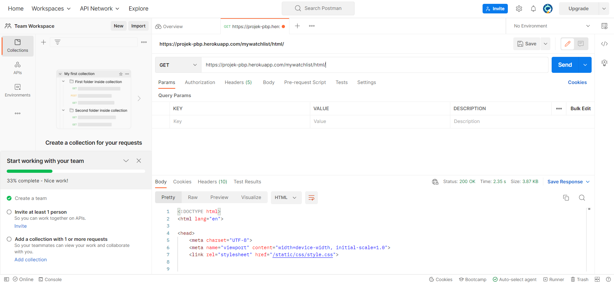
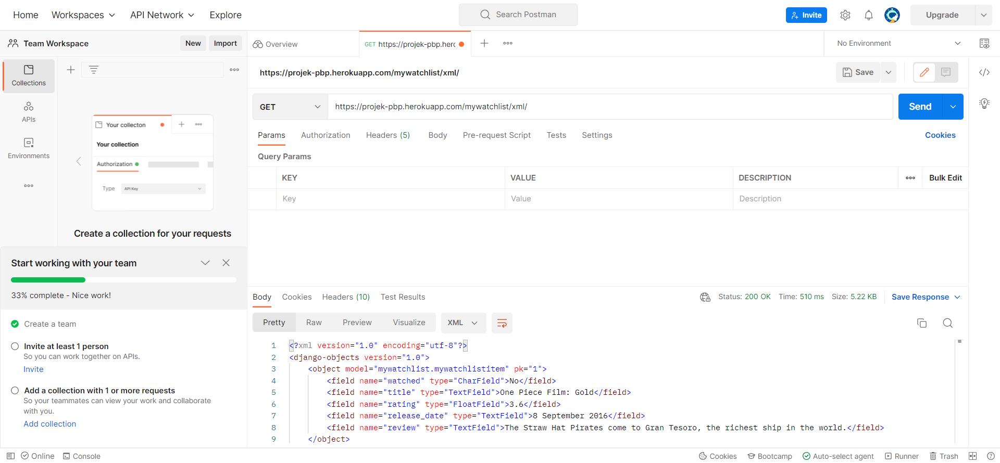

Link:
```
https://projek-pbp.herokuapp.com/mywatchlist
```

**1. Jelaskan perbedaan antara JSON, XML, dan HTML!**
JSON:
- Memakai ekstensi .json
- Syntax rules:
    1. Data dalam name/value yang berpasangan
    2. Data dipisahkan oleh koma
    3. Kurung kurawal untuk simpan objek
    4. Kurung persegi untuk simpan array
XML:
- Memakai ekstensi .xml
- XML DOM mendefinisikan cara untuk mengakses dan memanipulasi dokumen XML. Dokumen XML direpresentasikan dengan *tree structure*
- Syntax rules:
    1. XML Documents harus memiliki sebuah Root Element
    2. XML prolog itu optional. Jika ada, harus diawal dokumen 
    3. Semua elemen XML harus mempunyai *Closing Tag*
    4. XML tags itu *case sensitive*. Tag `Letter` berbeda dengan tag `letter`. Tag pembuka dan penutup harus ditulis dengan *case* yang sama(konsisten).

HTML:
- Menggunakan ekstensi .html
- HyperText Markup Language atau HTML, adalah standard markup language untuk design dokumen yang ditampilkan pada web browser.\
- HTML DOM mendefinisikan cara untuk mengakses dan memanipulasi dokumen HTML. Dokumen HTML direpresentasikan dengan *tree structure*.
- HTML mendefinisikan struktur dari halaman web secara semantik
- Elemen HTML
    <title>Page Title</title>
- Atribut HTML biasanya secara name/value, seperti: name = "value"

**2. Jelaskan mengapa kita memerlukan data delivery dalam pengimplementasian sebuah platform?**
Data delivery proses mentransfer data yang telah dibuat ke platform yang dituju. Data delivery dapat menjadi perantara untuk memudahkan transfer data ke platform. Data yang dikirim dalam format HTML, JSON, atau XML.

**3. Jelaskan bagaimana cara kamu mengimplementasikan checklist di atas**
1. Menambahkan aplikasi baru bernama `mywatchlist` dengan command
```
python manage.py startapp mywatchlist
```

2. Menambahkan path `mywatchlist` di folder `urls.py` dan mendaftarkannya pada bagian INSTALLED_APPS di `settings.py`  dengan command
```
path('mywatchlist/', include('mywatchlist.urls')),
```

```
'mywatchlist',
```

3. Model dibuat pada file `models.py` yang ada di folder `mywatchlist` lalu kita membuat `class` yang berfungsi untuk menampung objek dan attribute untuk mendefinisikan `key`
```
class MywatchlistItem(models.Model):
    watched = models.CharField(max_length=255)
    title = models.TextField()
    rating = models.FloatField()
    release_date = models.TextField()
    review = models.TextField()
``` 

4. Membuat folder `fixtures` di dalam `mywatchlist`. Di dalam fixtures akan diisi file `initial_mywatchlist_data.json` untuk menampung data-data yang akan ditambahkan pada html page.
```
[
    {
        "model": "mywatchlist.MywatchlistItem",
        "pk": 1,
        "fields": {
            "watched": "Tidak",
            "title": "One Piece Film: Gold",
            "rating": 3.6,
            "release_date": "8 September 2016",
            "review": "The Straw Hat Pirates come to Gran Tesoro, the richest ship in the world."
        }
    },
    {
        "model": "mywatchlist.MywatchlistItem",
        "pk": 2,
        "fields": {
            "watched": "Iya",
            "title": "Annihilation",
            "rating": 3.4,
            "release_date": "23 Februari 2018",
            "review":"A biologist signs up for a dangerous, secret expedition into a mysterious zone where the laws of nature don't apply."
        }
    },
    {
        "model": "mywatchlist.MywatchlistItem",
        "pk": 3,
        "fields": {
            "watched": "Tidak",
            "title": "The Gray Man",
            "rating": 3.3,
            "release_date": "22 Juli 2022",
            "review": "When the CIA's most skilled operative-whose true identity is known to none-accidentally uncovers dark agency secrets, a psychopathic former colleague puts a bounty on his head, setting off a global manhunt by international assassins."
        }
    },
    {
        "model": "mywatchlist.MywatchlistItem",
        "pk": 4,
        "fields": {
            "watched": "Iya",
            "title": "Spider-Man: No Way Home",
            "rating": 4.1,
            "release_date": "15 Desember 2021",
            "review": "With Spider-Man's identity now revealed, Peter asks Doctor Strange for help. When a spell goes wrong, dangerous foes from other worlds start to appear, forcing Peter to discover what it truly means to be Spider-Man."
        }
    },
    {
        "model": "mywatchlist.MywatchlistItem",
        "pk": 5,
        "fields": {
            "watched": "Iya",
            "title": "Divergent",
            "rating": 3.3,
            "release_date": "20 Maret 2014",
            "review": "In a world divided by factions based on virtues, Tris learns she's Divergent and won't fit in. When she discovers a plot to destroy Divergents, Tris and the mysterious Four must find out what makes Divergents dangerous before it's too late."
        }
    },
    {
        "model": "mywatchlist.MywatchlistItem",
        "pk": 6,
        "fields": {
            "watched": "Iya",
            "title": "X-Men: Apocalypse",
            "rating": 3.45,
            "release_date": "18 Mei 2016",
            "review": "In the 1980s the X-Men must defeat an ancient all-powerful mutant, En Sabah Nur, who intends to thrive through bringing destruction to the world."
        }
    },
    {
        "model": "mywatchlist.MywatchlistItem",
        "pk": 7,
        "fields": {
            "watched": "Iya",
            "title": "Knives Out",
            "rating": 3.9,
            "release_date": "27 November 2019",
            "review": "A detective investigates the death of the patriarch of an eccentric, combative family."
        }
    },
    {
        "model": "mywatchlist.MywatchlistItem",
        "pk": 8,
        "fields": {
            "watched": "Tidak",
            "title": "Scream",
            "rating": 3.15,
            "release_date": "12 Januari 2022",
            "review": "25 years after a streak of brutal murders shocked the quiet town of Woodsboro, Calif., a new killer dons the Ghostface mask and begins targeting a group of teenagers to resurrect secrets from the town's deadly past."
        }
    },
    {
        "model": "mywatchlist.MywatchlistItem",
        "pk": 9,
        "fields": {
            "watched": "Tidak",
            "title": "The Kings Man",
            "rating": 3.15,
            "release_date": "22 Desember 2021",
            "review": "In the early years of the 20th century, the Kingsman agency is formed to stand against a cabal plotting a war to wipe out millions."
        }
    },
    {
        "model": "mywatchlist.MywatchlistItem",
        "pk": 10,
        "fields": {
            "watched": "Iya",
            "title": "Ready Player One",
            "rating": 3.7,
            "release_date": "28 Maret 2018",
            "review": "When the creator of a virtual reality called the OASIS dies, he makes a posthumous challenge to all OASIS users to find his Easter Egg, which will give the finder his fortune and control of his world."
        }
    }
]
```

5. Buka file `views.py` pada `mywatchlist` lalu tambahkan

```
from django.http import HttpResponse
from django.core import serializers
```

Setelah itu buat fungsi yang menerima parameter request untuk mengembalikan data dalam bentuk HTML, XML, dan JSON
```
def show_html(request):
    data = MywatchlistItem.objects.all()
    context = {
    'list_barang': data,
    'nama': 'Achmad Noval Fahrezi',
    'student_ID': '2106750931'
    }
    return render(request, "mywatchlist.html", context)
```

```
def show_xml(request):
    data = MywatchlistItem.objects.all()
    return HttpResponse(serializers.serialize("xml", data), content_type="application/xml")
```

```
def show_json(request):
    data = MywatchlistItem.objects.all()
    return HttpResponse(serializers.serialize("json", data), content_type="application/json")
```

Tambahkan ke `urls.py` terus import fungsi yang sudah dibuat. Tambahkan ke path `urlpatterns`
```
from mywatchlist.views import show_xml 
from mywatchlist.views import show_json
from mywatchlist.views import show_html 
```


```
path('xml/', show_xml, name='show_xml'),
path('json/', show_json, name='show_json'),
path('html/', show_html, name='show_html'),
```

6.  Pertama buat folder `templates` untuk menyimpan file `mywatchlist.html`
```


 

  <h1>Lab 3 Assignment PBP/PBD</h1>

  <h5>Name: </h5>
  <p>{{nama}}</p>

  <h5>Student ID: </h5>
  <p>{{student_ID}}</p>

  <table>
    <tr>
      <th>watched</th>
      <th>title</th>
      <th>rating</th>
      <th>release_date</th>
      <th>review</th>
    </tr>
 Tambahkan data di bawah baris ini 

    <tr>
        <th>{{barang.watched}}</th>
        <th>{{barang.title}}</th>
        <th>{{barang.rating}}</th>
        <th>{{barang.release_date}}</th>
        <th>{{barang.review}}</th>
    </tr>

  </table>

 
```

Pada folder `urls.py` tambahkan
```
from django.urls import path
from mywatchlist.views import show_mywatchlist

app_name = 'mywatchlist'

urlpatterns = [
    path('', show_mywatchlist, name='show_mywatchlist'),
]
```

lalu memanggil `python manage.py runserver` untuk melakukan routing dan menjalankan aplikasi.

7. Buka `Settings -> Secrets -> Actions -> new repository secrets`. Lalu buka heroku dan copy `API` dan `nama projek aplikasi`, lalu tambahkan ke dalam repository secret. Setelah selesai jangan lupa untuk simpan perubahan.

8.  Mengakses melalui postman
 `HTML`
 
 

 `JSON`

 

 `XML`

 

9. Melakukan test URL dapat mengembalikan respon `HTTP 200 OK`
```
class MywatchlistTest(TestCase):
    def test_mywatchlist_show_html(self):
        response = Client().get('/mywatchlist/html/')
        self.assertEqual(response.status_code, 200)

    def test_mywatchlist_show_json(self):
        response = Client().get('/mywatchlist/json/')
        self.assertEqual(response.status_code, 200)

    def test_mywatchlist_show_xml(self):
        response = Client().get('/mywatchlist/xml/')
        self.assertEqual(response.status_code, 200)
```